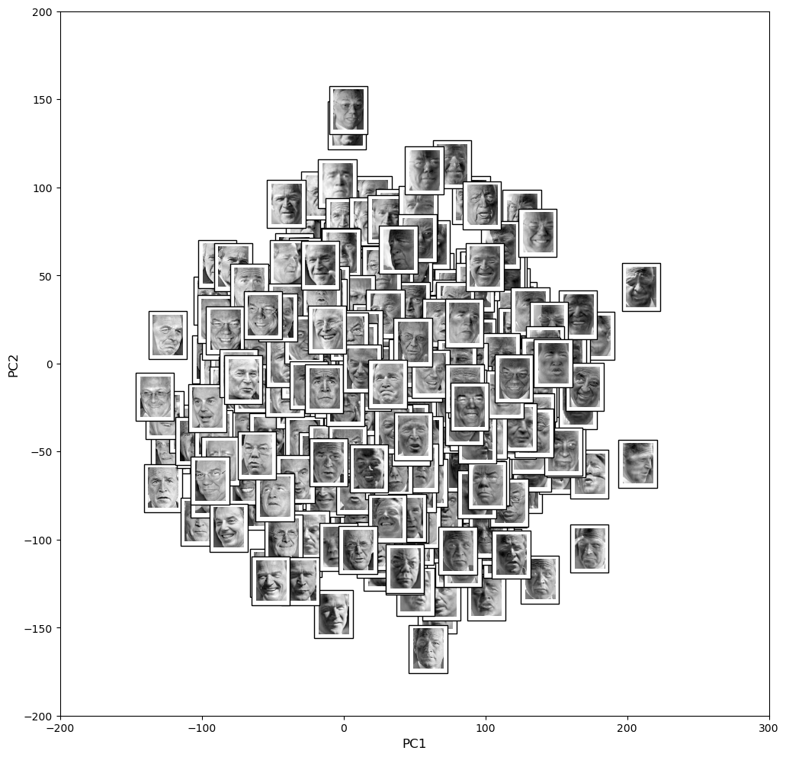

# PCA-LFW
Una práctica haciendo uso de PCA en el conjunto de datos Labelled Faces in the Wild.

Se considera el conjunto de datos Labelled Faces in the Wild (LFW) que consiste en fotografías de rostros recolectados de internet y contenido en *sklearn*. Algunos rostros identificados, tienen varias fotos incluídas en el dataset. Vamos a considerar solo aquellas personas que tienen al menos 70 fotografías de su rostro, también, vamos a considerar el tamaño original de la imagen $(125 \times 94)$.

Se realiza lo siguiente:
* Obtención las eigenfaces del conjunto de entrenamiento. Visualización de los scores de los primeros dos componentes principales identificando patrones.
* Proyección de los datos de prueba en los componentes principales. Se verifica si se *ubican* en su *individuo* correspondiente al graficarlos en los primeros dos componentes principales.
* Se utiliza el método del vecino más cercano para identificar a un *sujeto* de prueba en las imágenes de entrenamiento. Se considera sa la distancia euclideana en el espacio de los $p$ componentes principales, además se decide qué valor de $p$ usar.
* Se considera una(s) imágen(es) que no están en la base de datos y se realiza la prueba. 

## Resultados importantes.

En la Figura siguiente se muestran las primeras cuatro personas con más de 70 fotografías en el dataset teniendo un total de 1288.

  

El método de PCA se aplicó al conjunto de entrenamiento para 100 componentes, en la Figura 

  

podemos ver la proporción de la varianza explicada con respecto al número de componentes, observemos que si queremos el 80 $\%$ necesitamos los primeros 42 componentes principales, pero si con el $70 \%$ es suficiente, necesitamos los primeros 18 componentes principales, esto nos será de gran utilidad más adelante.

Posteriormente obtuvimos las primeras 12 eigenfaces, las cuales se muestran en la Figura 

  

Observemos que cada eigenface extrae información relevante de la cara, pero podemos notar que las primeras cuatro eigenfaces no tienen bien definidos rasgos faciales, estas primeras eigenfaces capturan los cambios de iluminación en el rostro, y a partir del Eigenface 4 se extraen los rasgos característicos del rostro.

Luego, se graficaron los scores de los primeros dos componentes principales, para poder identificar patrones se colocaron las fotografías originales en los puntos correspondientes, dicha gráfica se muestra en la Figura siguiente.

  

Podemos notar que si nos movemos hacia la izquierda, la mayoría de los rostros miran hacia ese lado, además que sonríen o tienen expresiona más alegres, mientras que si nos movemos hacia el lado derecho, la mayoría de los rostros también miran hacia ese lado, pero tienen expresiones más serias, el ceño fruncido, los cuales son los patrones que se pueden notar.

Para proyectar los datos de prueba en los componentes principales, transformamos los datos de prueba y los graficamos de forma conjunta con los datos de entrenamiento transformados, todo esto en los dos primeros componentes principales. Se construyó una gráfica interactiva diferenciando por el tipo de marcador entre la proyección de los datos de entrenamiento y de prueba, además de colorear por nombre, pero principalmente, de forma que al posicionarse en un punto se pueda desplegar el nombre de la persona (Se puede ejecutar en el Notebook proporcionado). Aquí se presenta un problema sobre el desbalance de los datos, hay muchas fotografías de George W Bush, en la gráfica el color morado lo representa, por lo que lo podemos ver por toda la gráfica, esto no nos da mucha información sobre si los datos de prueba se ubican realmente en su individuo al tener tantas repeticiones de la misma persona, por ejemplo, Hugo Chavez es la persona con el menor número de fotografías en los datos, en la gráfica lo podemos identificar con el color azul marino, sólo en un punto de prueba se encuentra con puntos de entrenamiento al rededor que corresponden a él, sin embargo en el resto de puntos no se identifica a la misma persona al rededor, pues también en el conjunto de entrenamientos se tienen pocos datos correspondientes a él.

Al hacer uso del método del vecino más cercano para identificar a un *sujeto* de prueba en las imágenes de entrenamiento  se tomó a alguna persona de prueba y se proyectó en el espacio de $p$ componentes, considerando diferentes valores de $p$, después se midió las distancias con respecto a los datos de entrenamiento en el mismo espacio para encontrar así al más cercano, la distancia utilizada fue la distancia euclideana. Se observan casos interesantes

  

en la Figura a) se muestra la identificación de una fotografía de Tony Blair, para $p=42$, recordemos que con ese número de componentes se recupera un $80 \%$ de la varianza total y en este caso, su vecino más cercano es efectivamente el mismo individuo con expresiones faciales diferentes, por otro lado, cuando se considera $p=100$ en el que se recupera aproximadamente el $90 \%$ de la varianza total y por tanto, en la proyección se pueden notar los rasgos más definidos, como se observa en la Figura c), en este caso su vecino más cercano es Donald Rumsfeld, pero pongamos atención en la expresión que tiene en la fotografía, la posición del rostro es hacia la misma dirección, aunque la mirada de Donald Rumsfeld es en dirección distinta a la del sujeto de prueba, además ambos tienen la boca abierta, su expresión en general es muy parecida, en este caso sus proyecciones son muy similares, por eso su identificación, finalmente para $p= 400$ tenemos más del $90 \%$ de la varianza total, mostrado en la Figura e), nos dice que su vecino más cercano es George W Bush, aunque el sujeto es equivocado, las expresiones faciales son más parecidas aún, sin embargo ya es estamos considerando un número considerable de componentes, en comparación con los 42 que utilizamos primero y que sí nos devolvió al sujeto correcto. 

Ahora pongamos atención en la Figura b) y d), donde se quiere identificar a Colin Powell, para este sujeto a pesar de tomar los componentes principales que nos devuelvan el $80 \%$ y $90 \%$ de la varianza total, en ninguno de los dos casos el vecino más cercano nos devuelve a la persona correcta, sin embargo la expresión facial de los vecinos más cercano es cada vez más parecida a la de nuestro sujeto de prueba. 

Los sujetos que se consideraron anteriormente aunque no cuentan con el número suficiente de fotografías como el caso de George W Bush, tampoco se encuentran dentro de los individuos con el menor número de fotografías.

Otros casos interesantes se muestran en la siguiente Figura

  

donde a) y c) corresponden a la indentificación de George W Bush, pero con diferentes fotografías, recordemos que es la persona con el mayor número de fotografías en la base de datos, se puede notar que para el mismo valor de $p$, en el primer fotografía, su vecino más cercano es efectivamente el mismo George Bush, sin embargo para la segunda fotografía no sucede lo mismo, pero su vecino más cercano tiene una expresión muy parecida a la del sujeto. En las Figuras b), d) queremos identificar a Ariel Sharon, quien es la segunda persona con el menor número de fotografías en la base de datos lo que puede hacer dificil su correcta identificación, para los valores de $p=18,  42, 100$, la proyección evidentemente cambia, pero el vecino más cercano en todos los casos es el mismo, que es lo que se quiere presentar en b). Por último, cuando el valor de $p=400$ el vecino más cercano es George Bush. Este último es un caso en el que no se va a ubicar en su individuo, lo que se debe en mayor parte al desbalanceo de los datos.

La identificación de un individuo de prueba en el espacio de los $p$ componentes es muy interesante porque se puede decir que está identificando bien a los individuos, en el sentido en el que tienen una gran cantidad de rasgos en común, expresiones, posición, etc., esto debido a que las proyecciones son muy similares y por eso los está identificando aunque no sea la persona correcta. El valor de $p$ influye en qué tanto parentezco van a tener y esto es claro, pues entre más componentes consideremos, se espera que el porcentaje de la varianza total extraida sea cada vez mayor.

Para un mayor análisis consultar el archivo 

Autor: Viridiana Itzel Méndez Vásquez ([viridiana.mendez@cimat.mx](mailto:viridiana.mendez@cimat.mx)).

